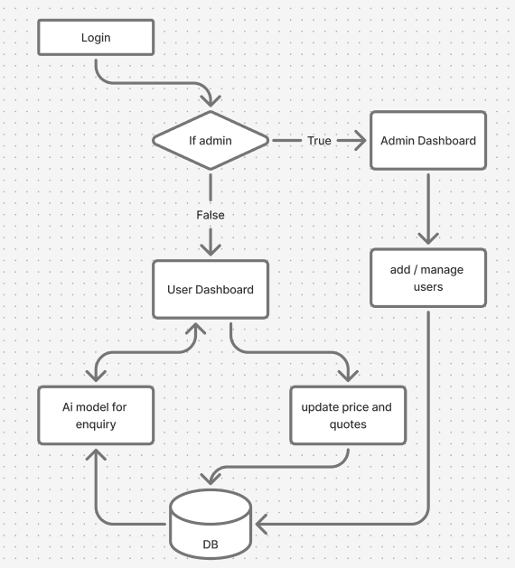

# Project Overview

This project implements a system with the following flow:

1. Employees log in to the system.
2. Based on their role:
   - Admins access the Admin Dashboard to manage employees and oversee operations.
   - Employees access the Employee Dashboard to interact with the AI model for inquiries or update prices/quotes.
3. All data is stored and retrieved from the database.

## Flowchart

Below is the flowchart representing the project workflow:

## Features

- Admin Dashboard:
  - Add/manage employees.
  - Oversee operations.
- Employee Dashboard:
  - Interact with the AI model for inquiries.
  - Update prices and quotes.
- Centralized database for data storage and retrieval.

## Setup Instructions

1. Clone the repository.
2. Install dependencies.
3. Run the application using the provided instructions.

https://www.figma.com/design/qQ2irMQLhjJKJtxO0jM6xe/Untitled?node-id=3-283&t=fwtgbZpLsKM2q2oG-1

Database Schema

